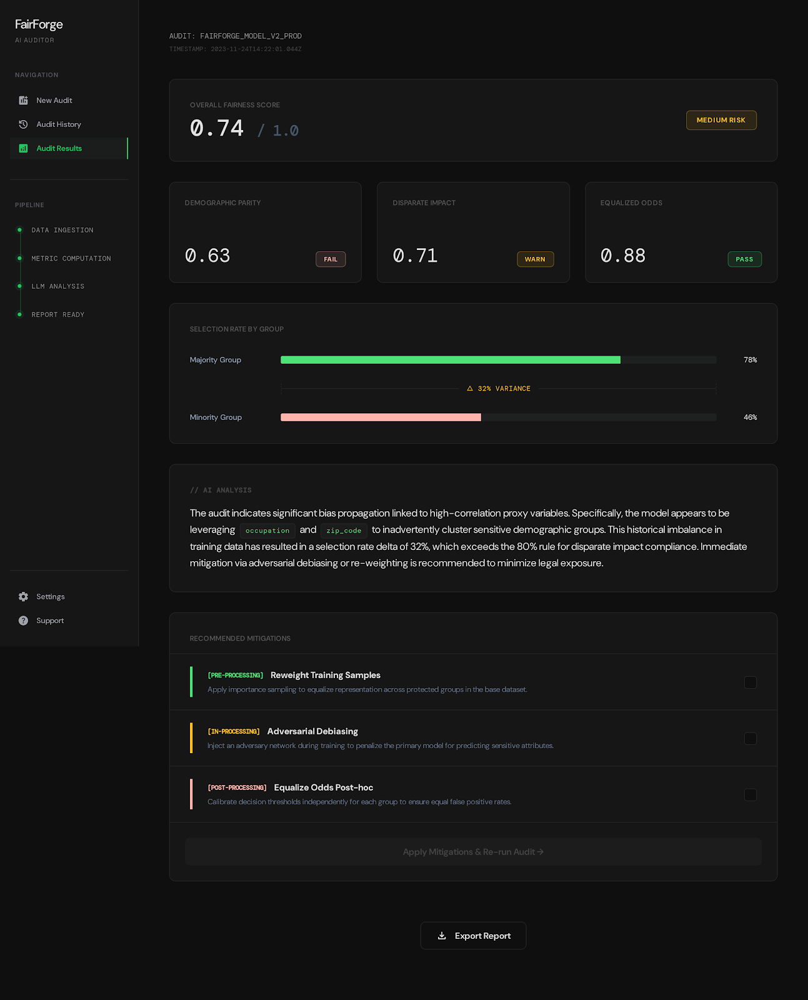
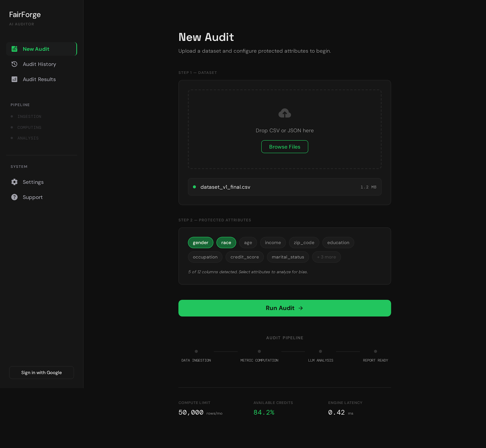
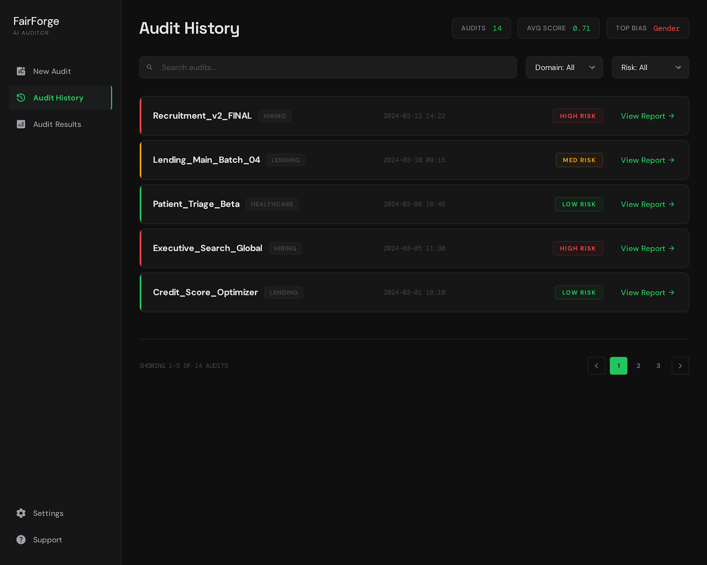

<div align="center">
  
  <br/>
  <h1>FairForge 🛡️</h1>
  <p><b>A modern, full-stack Machine Learning bias audit and mitigation platform built for the Enliven Hackathon.</b></p>
  <p>Empowering developers and data scientists to directly audit their models for fairness, mathematically mitigate systemic biases, and establish a clear, documented audit trail.</p>
</div>

<br/>

<div align="center">
  
  &nbsp;&nbsp;&nbsp;&nbsp;
  
</div>

---

## 🌟 The Problem & Our Solution
As AI systems become foundational to society, undetected data biases (like ageism, sexism, or racism embedded in historical datasets) lead to unfair automated decisions. 

**FairForge** solves this by providing an end-to-end fairness loop. You upload your model's pipeline data, and FairForge automatically maps out the discrepancies, uses GenAI to explain *why* the bias exists, and provides mathematical tools to immediately generate a fairer, mitigated dataset.

---

## 🚀 Key Features

### 1. 🧠 Intelligent Data Inference 
* **Zero-Config Parsing:** Automatically detects your predictions (`score`, `pred`, `probability`) and ground truths (`hired`, `target`, `outcome`).
* **Continuous Binarization:** Seamlessly handles continuous ML probabilities by identifying thresholds, producing highly accurate, deterministic metrics.
   
### 2. 📊 Deep ML Bias Metrics
* **Math-Backed Audits:** rigorously calculates **Demographic Parity** and **Equalized Odds** using the industry-standard `fairlearn` engine.
* **Risk Categorization:** Outputs easy-to-digest risk levels based on aggregated score deficits.

### 3. 🤖 GenAI Bias Explanation 
* **Gemini 2.5 Flash / Gemini Pro:** Dynamically analyzes the numerical fairness deficits and translates mathematical discrepancies into plain-English explanations.
* **Proxy Detection:** Identifies the exact "proxy features" (e.g., zip codes correlating to race) that trick the ML model into biased behavior.

### 4. 🛠️ Multi-Strategy Mitigation Engine
Take action directly in the UI. Select from:
   * **Pre-processing:** Re-weighting the representation of demographics.
   * **In-processing:** Adversarially removing the hidden proxy indicators Gemini found.
   * **Post-processing:** Optimizing prediction thresholds for Equalized Odds.
* **Instant ROI:** See an immediate *Before vs. After* evaluation of how your ML metrics improved inside the dashboard.
* **Fairer Exports:** Download the mitigated dataset with a clean `mitigated_decision` column to seamlessly integrate fairer outcomes back into your pipeline.

### 5. 💬 Integrated Support AI & Traceability
* **Hackathon Support Bot:** Chat directly with the embedded Gemini Support agent, grounded contextually in ML fairness strategies to guide non-technical users.
* **Audit Logs:** Connects to MongoDB Atlas for a persistent history of model checks, securely backed by Supabase cloud storage.

---

## 🛠️ Tech Stack

<table style="width:100%">
  <tr>
    <td align="center"><b>Frontend</b></td>
    <td align="center"><b>Backend</b></td>
    <td align="center"><b>Database/Cloud</b></td>
    <td align="center"><b>AI/ML Math</b></td>
  </tr>
  <tr>
    <td align="center">Flutter Web (Dart)<br/>Go Router<br/>FL Chart</td>
    <td align="center">Python <br/>FastAPI <br/>Uvicorn</td>
    <td align="center">MongoDB Atlas<br/>Supabase Storage<br/>Motor (Async)</td>
    <td align="center">Google Generative AI SDK<br/>Pandas & Numpy<br/>Fairlearn Core</td>
  </tr>
</table>

---

## ⚙️ How To Run Locally

### Prerequisites
- Python 3.10+
- Flutter SDK (stable channel)
- A local `.env` file mapping `MONGODB_URI`, `GEMINI_API_KEY`, `SUPABASE_URL`, and `SUPABASE_KEY`.

### 1. Launch the Backend API
```bash
cd backend
pip install -r requirements.txt
uvicorn main:app --reload
```
*The FastAPI server will spawn successfully on `http://127.0.0.1:8000`.*

### 2. Launch the Web Frontend
```bash
cd frontend
flutter pub get
flutter run -d chrome
```

---

## 🎯 Example Hackathon Flow
1. **Upload Dataset:** Provide our sample `sample_data.csv` which contains features, probabilities, and demographics.
2. **Review Biases:** Watch the engine calculate that your ML Equalized Odds dropped dramatically for a protected group.
3. **Trigger Mitigation:** Ask FairForge to apply Pre and Post-processing Adjustments based on the Gemini proxy detections.
4. **Compare & Download:** View the significantly improved outcome parity, and export the corrected data for your model!

<div align="center">
  <br/>
  <b>Built with ❤️ for the Enliven3 Hackathon.</b>
</div>
